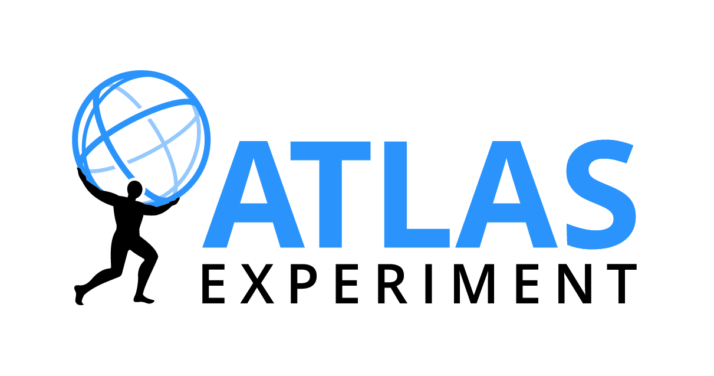

# Working with the ATLAS Data&Tools Virtual Machine

This book contains the necessary steps in order to get the [http://atlasoutreach.web.cern.ch/atlasoutreach/extendedanalysis/](ATLAS-outreach Virtual Machine) (from now "**ATLAS-VM**") ready to run and create [https://en.wikipedia.org/wiki/Particle_physics](_high energy physics_) analysis using [atlas.cern](ATLAS public data)!

# 
